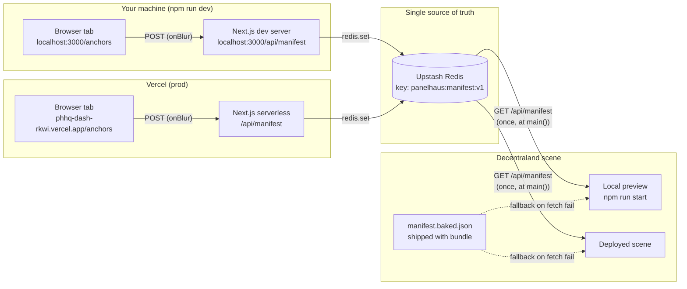

# Save Flow — Dashboard to Scene

How an edit on `/anchors` (or `/pieces`) ends up rendered on a wall. Useful for understanding what "save" actually does, why local edits are visible in production, and where the round-trip can break.

## The short version



## What "save" does, step by step

1. **You type in an input on `/anchors`.** No save yet — `defaultValue` + `onBlur`, see [app/anchors-view.tsx:71-91](../app/anchors-view.tsx#L71-L91).
2. **You blur or hit Enter.** `updateAnchorDims` builds the full next-manifest in memory and calls `saveManifest(next)` from [lib/client.ts:9](../lib/client.ts#L9).
3. **`fetch('/api/manifest', POST, body=full manifest)`** hits your local Next or Vercel — whichever origin your browser is on.
4. **The API route** ([app/api/manifest/route.ts:27](../app/api/manifest/route.ts#L27)):
   - Checks NextAuth session — anonymous POSTs get `401`.
   - Re-validates the entire manifest with Zod — bad data gets `422`.
   - Reads the existing manifest, bumps `version`, sets `updatedAt`.
   - `redis.set("panelhaus:manifest:v1", next)`.
   - Returns the saved manifest.
5. **The UI** sets state from the response and flashes `Saved · v<N>` for 1.8s.

## Local vs. production: same store

This is the part that surprises people. Look at [lib/redis.ts:13-14](../lib/redis.ts#L13-L14):

```ts
const url = pickEnv("UPSTASH_REDIS_REST_URL", "KV_REST_API_URL");
const token = pickEnv("UPSTASH_REDIS_REST_TOKEN", "KV_REST_API_TOKEN");
```

Upstash is a REST-over-HTTPS Redis. There is no localhost instance. **Whatever URL/token is in your `.env.local` is the database your local dev server writes to.** If those values match production (which they usually do during development), then:

- Editing on `localhost:3000/anchors` mutates the same row that `phhq-dash-rkwi.vercel.app/anchors` reads.
- The deployed scene fetching the public manifest URL sees your local edits within seconds (modulo the 10s edge cache on the GET — [app/api/manifest/route.ts:20](../app/api/manifest/route.ts#L20)).

This is convenient but a footgun. If you ever want isolated local data, point `.env.local` at a separate Upstash database, or stub out the redis client.

## Why the scene needs a restart

The scene fetches once, in `main()`, then never again. There's no websocket, no poll, no SSE. So:

- **Dashboard save → Redis updated:** ~200ms.
- **Scene picks up the change:** only at next scene boot. Reload the preview, or in production the next time a player loads in.

Refreshing the dashboard tab does refetch (GET `/api/manifest`), so you'll see the latest in the UI immediately. The lag is scene-side only.

## Failure modes

| What breaks                                   | What happens                                                                           |
| --------------------------------------------- | -------------------------------------------------------------------------------------- |
| Redis credentials missing in `.env.local`     | POST returns 500. The `[redis] missing ...` warning logs at server start.              |
| Not logged in                                 | POST returns 401. UI surfaces it as the red error banner.                              |
| Schema-invalid manifest (e.g. negative width) | POST returns 422 with the first 10 Zod issues. UI shows the stringified error.         |
| Upstash is down                               | POST fails. Existing baked fallback in the scene keeps it rendering last-deployed art. |
| Scene fetch fails at boot                     | Scene loads `manifest.baked.json` instead. No crash, possibly stale art.               |

## Cache layers to remember

- `fetch('/api/manifest', { cache: 'no-store' })` in [lib/client.ts:4](../lib/client.ts#L4) — dashboard reads are always fresh.
- `cache-control: public, max-age=10, stale-while-revalidate=60` on the GET response — Vercel's edge may serve a 10-second-old copy to the scene. Usually fine; if you need instant-instant, hit the URL with a cache-buster query param.
- Scene-side `manifest.baked.json` — only loaded on fetch failure, so it doesn't mask live edits unless the network breaks.

## One-line mental model

> The dashboard is a typed editor for one Redis key. Everything else — auth, validation, the scene — is plumbing around that one write.
